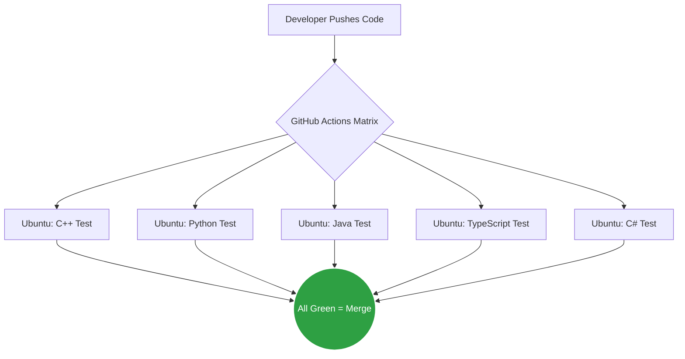

  <h1>🚀 Awesome Modern SE Algorithms</h1>
  
<b>150 Production-Grade System Design & Software Engineering Algorithms</b>

  
  
  
  
  

   
  <i>Bridging the gap between competitive programming and real-world system architecture.</i>

---

## ⚡ The Architecture
This repository doesn't just store code; it mathematically proves it works. Every push triggers a parallel CI/CD matrix that tests all 5 languages simultaneously.

## 📚 Table of Contents (The Syllabus)

> **⚠️ NOTE:** This repository is being actively updated daily. New architectural patterns and algorithms are pushed every 24 hours.

### 🌐 1. System Design & Infrastructure (Current Focus)
| Algorithm | Real-World Application | Status |
|---|---|---|
| **Consistent Hashing** | Database Sharding (Redis, DynamoDB) | ✅ Available |
| **Bloom Filter** | Malicious URL fast-rejection (Chrome) | ✅ Available |
| **LRU Cache** | High-speed memory management | ✅ Available |
| **Circuit Breaker** | Microservice resilience & fault tolerance | ✅ Available |
| Token Bucket | API Rate Limiting | ⏳ Coming Soon |
| Merkle Tree | Blockchain state verification | ⏳ Coming Soon |

### 🤖 2. AI & LLM Patterns
| Algorithm | Real-World Application | Status |
|---|---|---|
| **Monte Carlo Tree Search (MCTS)** | Advanced Game AI & LLM Reasoning | ✅ Available |
| Retrieval-Augmented Gen (RAG) | Feeding real-time data to LLMs | ⏳ Coming Soon |
| Sliding Window Chunking | Preparing documents for Vector DBs | ⏳ Coming Soon |

### 🚀 3. Core DSA (Highly Optimized)
| Algorithm | Real-World Application | Status |
|---|---|---|
| **Tarjan's SCC** | Detecting circular dependencies | ✅ Available |
| **Lazy Segment Tree** | Range queries for analytics & games | ✅ Available |
| A* Search | Game dev pathfinding | ⏳ Coming Soon |
| KMP Search | Genetic DNA string matching | ⏳ Coming Soon |

---

## 🤝 Want to Contribute?
Did you find a way to optimize an algorithm? Can you shave off a few milliseconds or improve the space complexity? 

We welcome genius-level pull requests. Please read our [CONTRIBUTING.md](./CONTRIBUTING.md) for the single-file testing rules before submitting.

  <b>⭐ If this repository helps you master System Design, please leave a Star! ⭐</b>

